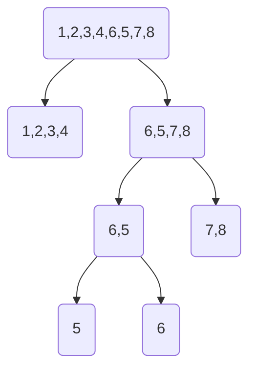

# Vjude 第七周 F 题讲解

## 题意

给定一段长度为 $2^n\left( n \in \left[1,4\right]\,\right)$ 的数组，二分数组，直到子数组非降序[^1]排列，输出最长的非降序排列的数组长度

## 分析

其实这个题数据方面非常的友好，用起分治来不需要考虑太多，刚好二分完所有问题

## 方法

### 图解



### 代码

#### 递归

```cpp
int func(int l, int r){
    if (is_sorted(num.begin() + l - 1, num.begin() + r))
    //这里使用了库函数is_sorted，作用是判断该序列是否非降序排列，下面也有相似的实现。
        return r - l + 1;
    else{
        int mid = (l + r) >> 1;
    //括号有没有虽然不影响最终结果，但请注意编译器提供的警报信息，这对写出逻辑清晰的代码有帮助
        return max(func(l, mid), func(mid + 1, r));
    }
}
```

上面的 if 部分就是分治中的解决步骤，else 部分则为分解与合并的部分

#### 非递归

```cpp
int solve(){
    bool status = 0;
    for (int i = n; i > 1; i >>= 1){
        for (int j = 1; j <= n; j += i){
            status = 1;
            for (int k = j - 1; k < j + i - 2; k++)
                status &= (num[k] <= num[k + 1]);
            if (status)
                return i;
        }
    }
    return 1;
}
```

[^2]这个地方一共有三层循环，第一层是遍历子数组的长度，第二层是遍历相同长度的子数组，第三层则是遍历每个元素，判断其与下一个元素是否成非降序排列

[^1]:非降序与升序不同，非降序为 $a[n] \leq a[n+1]$ ，而升序为 $a[n] \textless a[n+1]$
[^2]:感谢黄忆杭提供的思路